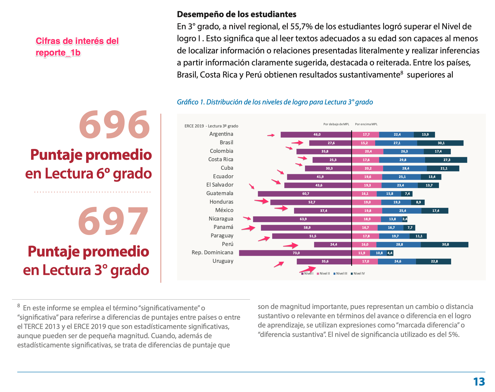

---

# Introducción

- Vamos a reproducir la proporción de estudiantes de tercer grado que se encuentra por debajo del mínimo de competencia lectora esperado, para cada uno de los países de ERCE 2019.

- Este resultado se encuentra publicado en el informe ejecutivo de resultados de ERCE 2019 (UNESCO-OREALC, 2021), en la página 13. La siguiente figura incluye el resultado que queremos reproducir.

```{r echo = FALSE, out.width = '100%', fig.retina = 1}

```

- En esta plantilla, se incluyen sugerencias de que códigos emplear en algunos pasos, para facilitar el desarollo de este reporte.

- Los códigos de ejemplos que pueden ser empleados en este reporte, se encuentran disponibles en: https://github.com/dacarras/edu4050_2024_example_1


# Instrucciones

* Recuerde... 
     - no alterar el formato de este documento y responder en los espacios asignados
     - descargar la base de datos y subirla a la nube de este proyecto

¡Éxito!


---

# Ejercicio 1

- Instale las librerías que se requieren para este reporte.

```{r, echo = TRUE, eval = FALSE}


# collection of libraries to handle data
install.packages('tidyverse')

# library to install libraries from github
install.packages('devtools')

# library with ERCE 2019 data
devtools::install_github('dacarras/erce',force = TRUE)

# library to generate survey estimates
install.packages('survey')

# library to generate survey estimates
install.packages('srvyr')

# library to get estimates with plausible values
install.packages('mitools')

# library to save tables into excel
install.packages('openxlsx')
```


# Ejercicio 2

- Inserte los códigos para cargar la base de datos en su proyecto de R Studio, R studio Cloud bajo el nombre ‘data_erce’.

```{r}

# Cada texto despues de un "#" es un comentario
#
# Agregue los códigos de cada ejercicio, en estas secciones del archivo.
# para abrir los datos de tercer grado, podemos ocupar el siguiente código:
# 
# erce::erce_2019_qa3

```


# Ejercicio 3

- Remueva los labels de la base de datos. Esto es importante para crear el objeto `survey`.

```{r}

# para remover las labels de la base datos original, vamos a emplear
# la función `erce::remove_labels()`

```

# Ejercicio 4

- Inserte el código para abrir una vista previa de su base de datos empleando a la función `dplyr::glimpse()`

```{r}

# Pegue o escriba los códigos utilizados en la siguiente línea [no coloque el signo gato antes de su respuesta]

```


# Ejercicio 5

- Genere las variables de anidación o de clustering generales.

```{r}

# Los códigos para este paso son los siguientes:
#
# mutate(id_s = as.numeric(as.factor(paste0(IDCNTRY, "_", STRATA)))) %>%
# mutate(id_j = as.numeric(as.factor(paste0(IDCNTRY, "_", IDSCHOOL)))) %>%
# mutate(id_i = seq(1:nrow(.)))

```

# Ejercicio 6

- Recodifique de las variables de niveles de competencia, según corresponda.

```{r}

# En esta sección de recomienda emplear la función `dplyr::case_when`.
# Esta se encuentra ilustrada en el ejemplo de clases
# (ver: https://github.com/dacarras/edu4050_2024_example_1)
#
# Tambien es posible emplear a la función `dpyr::if_else()`

```

# Ejercicio 7

- Especifique el diseño del estudio como objeto survey, empleando *Taylor Series Linearization*. 
  + El peso total para los estudiantes, escalado es `WS`
  + La variable de estrato es `id_s`
  + La variable *primary sampling unit* es `id_j`


```{r}

# En esta sección se puede especificar el diseño con la función 
# `survey::svydesign()`. Esto se encuentra cubierto en el ejemplo de clases
# ver: https://github.com/dacarras/edu4050_2024_example_1)

```

# Ejercicio 8

- Estime el porcentaje de interés, y despliegue el resultado con `summary(mitools::MIcombine(results))`

```{r}


# En esta sección empleamos a la función `mitools::withPV()`, y a la
# a la función `survey::svyby` para obtener medias de valores plausibles por país.
# un ejemplo de como implementar este codigo se encuentra en:
#
# https://github.com/dacarras/erce_2022_lsa/blob/main/02_ejemplos/03_descriptivos_codigos.rmd
#
# ver líneas 627 a 637

```

# Ejercicio 9

- Describa la proporción de estudiantes que no alcanza el nivel mínimos de comprensión para el país con menor resultado, y para el país con mayor resultado.

- **Respuesta**
  + `indique su respuesta en estas líneas`.

# Ejercicio 10

- Genere un objeto con los resultados obtendos con `summary(mitools::MIcombine(...))`,  genere una tabla que pueda desplegar con un solo decimal, empleando a `knitr::kable(..., digits = 1)`.


```{r}

# Ver líneas 271 a 307 del ejemplo cubierto en clases
#
# link: https://github.com/dacarras/edu4050_2024_example_1/blob/main/edu4050_e01_m04_code_example.rmd

```

# Ejercicio 11

- Exporte la tabla de resultados a un archivo excel llamado "table_less_than_minimum_reading_proficiency_3th_graders_by_country.xlsx".

```{r}

# Ver líneas 323 a 326 del ejemplo cubierto en clases
#
# link: https://github.com/dacarras/edu4050_2024_example_1/blob/main/edu4050_e01_m04_code_example.rmd

```


# Ejercicio 12

- Explique con sus propias palabras, porque es necesario generar las variables `id_s` y `id_j`, antes de producir un resultado regional o *pooled estimates*.

- **Respuesta**
  + `indique su respuesta en estas líneas`.


# Ejercicio 13

- Explique con sus propias palabras cual es la ventaja de emplear el diseño del estudio para producir las cifras de interés.

- **Respuesta**
  + `indique su respuesta en estas líneas`.


# Ejercicio 14

- Explique con sus propias palabras porque se emplean valores plausibles, para producir la cifras de interés.

- **Respuesta**
  + `indique su respuesta en estas líneas`.


# Referencias

UNESCO-OREALC. (2021). Los aprendizajes fundamentales en América Latina y el Caribe. https://en.unesco.org/sites/default/files/resumen-ejecutivo-informe-regional-logros-factores-erce2019.pdf_0.pdf

